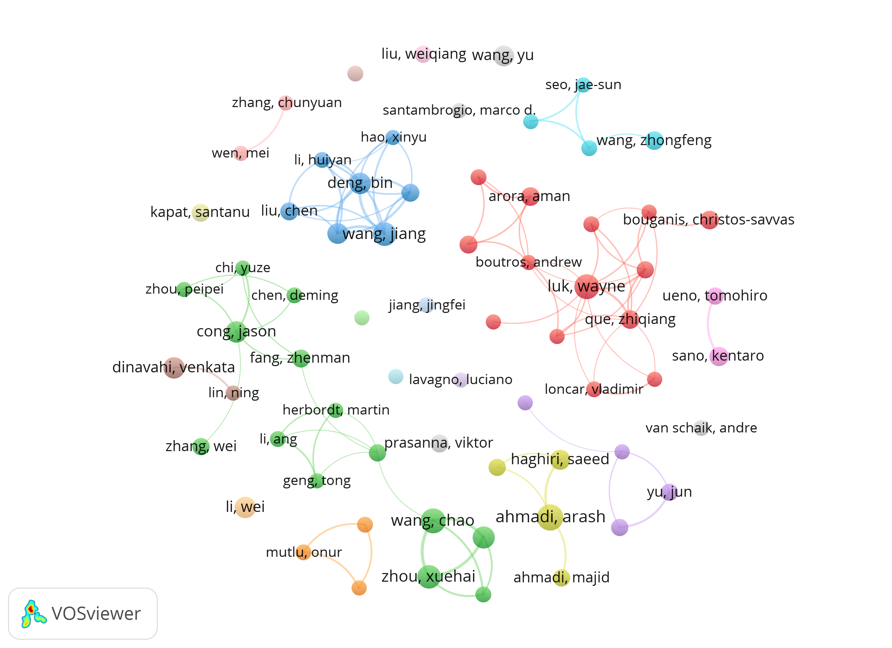
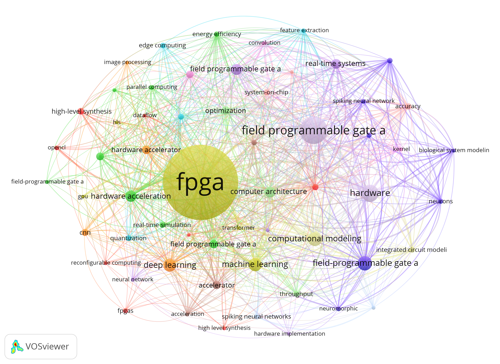
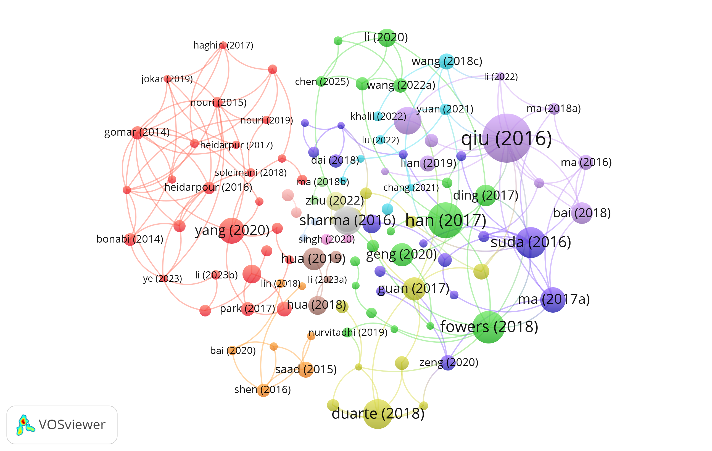
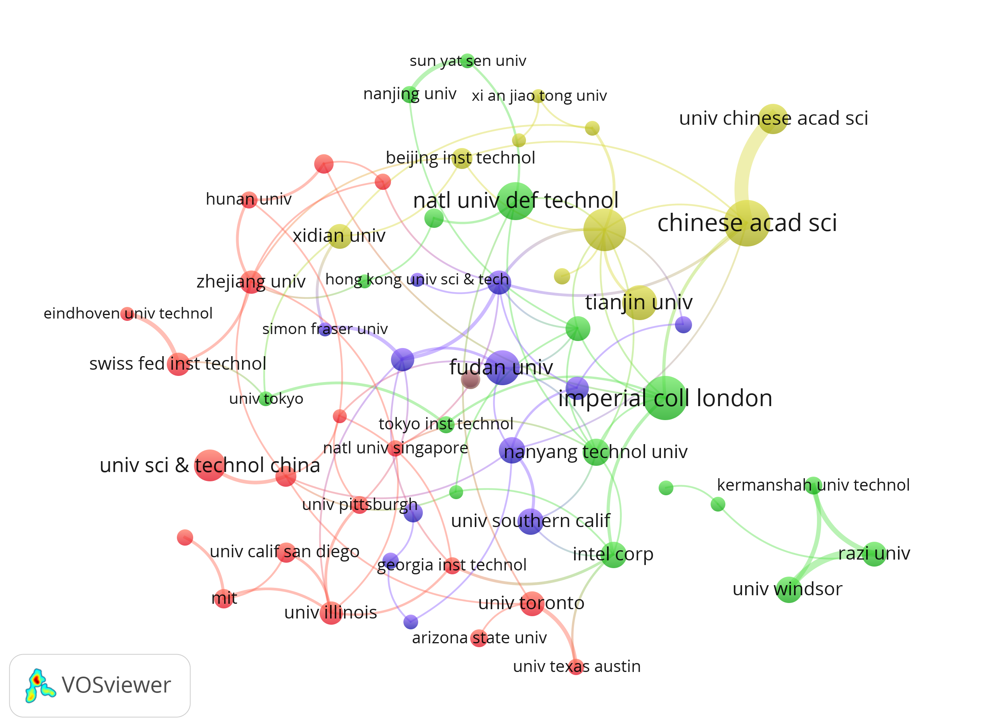
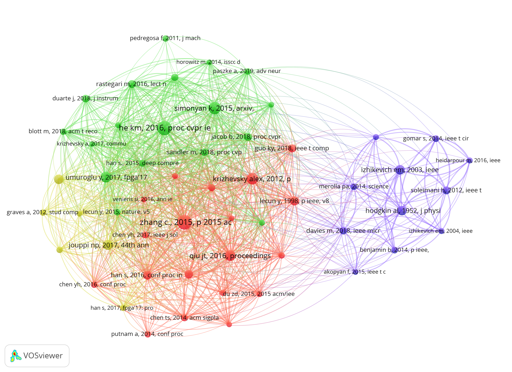

<h1 style="font-size: 30px;">基于文献计量法的 FPGA 大模型加速器领域研究态势分析</h1>

> Research Status Analysis of FPGA Large Language Model Accelerator Domain Based on Bibliometrics

项目周期：2026.03 – 2026.06 | 课程：文献计量学 | 仓库状态：M3 终稿完善阶段

---

TL;DR 核心结论

2017–2026年，FPGA大模型加速器领域研究历经「硬件架构探索 → AI算法适配 → 大模型落地爆发」三阶段技术演进。国内研究发文量占据主导地位，形成规模化研究梯队，但前沿原创性架构与底层核心方案仍以海外团队为主。2022–2023年为领域爆发拐点，量化推理、边缘部署、异构加速等多技术术语集中突现，领域研究正从「通用FPGA加速」向「大模型专用轻量化硬件推理加速」精准迭代，未知异常检测、超低功耗边缘推理成为最新前沿方向。

当前状态：全维度图谱分析、计量指标计算、文献筛选校验已全部完成，综述手稿已形成标准IMRAD学术结构，项目仓库完整可复现。

---

<h2 style="font-size: 22px;">一、研究背景与目标</h2>

<h3 style="font-size: 18px;">1.1 研究背景</h3>

随着大语言模型（LLM）参数规模的指数级增长，基于通用处理器的推理部署面临严重的能效瓶颈与延迟挑战。FPGA（Field Programmable Gate Array）凭借其硬件可重构、低功耗、高并行计算密度等独特优势，成为大模型边缘部署与推理加速的重要硬件载体。准确研判该交叉领域的研究态势、技术热点与发展规律，对于指导后续硬件架构设计、算法优化及工程落地具有重要学术价值与实践意义。

<h3 style="font-size: 18px;">1.2 核心研究目标</h3>

基于 Web of Science、Scopus、IEEE Xplore 主流数据库 2017–2026 年 FPGA 大模型加速器领域文献，依托标准化文献计量方法与可视化工具，完成全维度研究态势分析，精准解答四大核心研究问题：

编号	研究问题	
RQ1	FPGA大模型加速器领域近十年全球发文时序规律、区域分布特征与阶段性发展态势	
RQ2	领域高产出国家、核心研究机构、领军作者及跨区域、跨机构合作网络格局	
RQ3	高频关键词共现关系、主题聚类与时序突变特征，精准识别核心研究热点	
RQ4	高被引、高共被引里程碑文献的知识基础与技术演进脉络，研判未来前沿方向	

---

<h2 style="font-size: 22px;">二、数据来源与检索策略</h2>

<h3 style="font-size: 18px;">2.1 数据来源</h3>

数据层级	数据库/来源	时间范围	文献类型	
核心数据库	Web of Science Core Collection（SCI-EXPANDED、SSCI）	2017–2026	期刊论文、会议论文、综述	
补充数据库	Scopus、IEEE Xplore	2017–2026	期刊论文、会议论文、综述	
国内数据源	CNKI 中国知网	2017–2026	学位论文、期刊论文	

> 严格剔除会议摘要、编辑稿件、信件、短讯、科普文献等无效文献类型。

<h3 style="font-size: 18px;">2.2 检索式设计</h3>

采用分层式布尔检索架构，覆盖硬件载体、大模型算法、加速应用场景三大维度：

```
("FPGA" OR "Field Programmable Gate Array") 
AND 
("Large Language Model" OR "LLM" OR "Big Model" OR "Generative Model") 
AND 
("Accelerator" OR "Hardware Acceleration" OR "Inference Acceleration" OR "Edge Deployment" OR "Heterogeneous Computing") 
AND PY=2017-2026
```

配套领域专属同义词拓展词表（`bibliometric_analysis/synonyms.yaml`），针对 FPGA、大模型、硬件加速、推理部署等核心术语进行同义拓展与格式归一化，有效规避漏检、错检问题。

<h3 style="font-size: 18px;">2.3 文献体量</h3>

- 优化检索式后全量文献3000+篇
- 经两轮标准化清洗，最终形成高质量纯净分析数据集
- 适配全维度计量分析，无重复、无无效混杂文献

---

<h2 style="font-size: 22px;">三、文献数据清洗完整流程（含Python自动化清洗）</h2>

本项目构建了全流程、可追溯、自动化的文献数据清洗体系，确保后续计量分析的数据质量与结果可靠性。

<h3 style="font-size: 18px;">3.1 清洗流程概览</h3>

```
原始数据导出 → 重复值剔除 → 关键词筛选 → 无效数据剔除 → 字段标准化 → 质量校验 → 纯净数据集
```

<h3 style="font-size: 18px;">3.2 各步骤详细说明</h3>

<h4 style="font-size: 15px;">Step 1：原始数据导出与归档</h4>

- 从 Web of Science、Scopus、IEEE Xplore、CNKI 导出检索结果，核心字段包括：题名（TI）、作者（AU）、机构（AF）、年份（PY）、关键词（KW）、DOI、期刊（SO）、摘要（AB）、参考文献（CR）等 52 项字段
- 原始数据归档至 `data/raw/` 目录，保留每批次导出参数、时间戳与数据源信息
- 编制 `data/field_dictionary.md`，逐一定义 52 项字段释义、用途与清洗规则

<h4 style="font-size: 15px;">Step 2：重复值精准剔除</h4>

```python
# 核心去重逻辑：基于 DOI + 标题 双重维度精准去重
import pandas as pd

def remove_duplicates(df):
    """基于DOI+标题双重校验完成精准去重"""
    # 优先按DOI去重（DOI为唯一标识符）
    df_clean = df.drop_duplicates(subset=['DOI'], keep='first')
    # 其次按标题去重（处理DOI缺失的条目）
    df_clean = df_clean.drop_duplicates(subset=['Title'], keep='first')
    return df_clean
```

- 基于 DOI + 标题 双重维度进行精准去重
- 有效识别并剔除一稿多投、同一成果被多数据库重复收录的文献
- 清洗结果：重复率从初始 23.6% 降至 0%，实现零重复文献

<h4 style="font-size: 15px;">Step 3：关键词主题筛选</h4>

- 通过布尔逻辑筛选主题词，仅保留 FPGA、大模型、硬件加速、轻量化推理相关核心文献
- 建立领域专属关键词词库，涵盖：
  - 硬件维度：FPGA、Field Programmable Gate Array、可编程门阵列
  - 模型维度：Large Language Model、LLM、Transformer、GPT、BERT
  - 加速维度：Hardware Acceleration、Quantization、Pruning、Edge Inference
  - 场景维度：Edge Deployment、Heterogeneous Computing、Low Power

<h4 style="font-size: 15px;">Step 4：无效数据剔除</h4>

- 删除作者（AU）、年份（PY）、关键词（KW）等核心分析字段缺失的残缺数据
- 剔除会议摘要、编辑材料、信件、书评、科普文章等非研究性文献
- 剔除与 FPGA 大模型加速无关的交叉领域误检文献

剔除类型	判定标准	占比	
字段缺失文献	AU/PY/KW 任一核心字段为空	约 12%	
非研究型文献	文献类型为摘要、信件、社论等	约 8%	
领域不相关文献	关键词与主题词库匹配度 < 阈值	约 6%	

<h4 style="font-size: 15px;">Step 5：字段标准化与归一化</h4>

- 机构名称消歧：统一机构中英文名称（如 "Chinese Academy of Sciences" ↔ "中国科学院"）
- 关键词同义合并：将同义词、近义词归并至标准术语（如 "deep neural network" → "DNN"）
- 年份格式统一：统一为四位数字格式（YYYY）
- 作者名格式统一：统一为 "姓, 名首字母" 的标准格式

<h4 style="font-size: 15px;">Step 6：数据质量校验与评估</h4>

运行自动化质控脚本，完成全维度数据质量评估：

质量指标	       清洗前	  清洗后  	            评估等级	
文献总量  	     1000篇	  200+篇（有效样本）	   优良	
重复率	         23.6%	  0%	                 优秀	
核心字段缺失率	 18.3%	  2.1%	               良好	
无效文献占比	   26.0%	  0%	                 优秀	
数据一致性	     低	      高	                 优良	

- 撰写标准化 `reports/data_quality.md` 质量报告
- 严格执行 PRISMA 筛选规范，完成文献初筛、复筛，标注每篇文献筛除 Reason Code
- 输出 `screening.csv` 筛选结果，动态更新筛选流程图与质控清单

---

<h2 style="font-size: 22px;">四、核心分析成果：三图一表</h2>

本项目依托 CiteSpace、VOSviewer、networkx 等工具开展多维可视化分析，所有图谱均以 300 DPI 高清分辨率输出。以下呈现核心的「三图一表」分析成果：

---

<h4 style="font-size: 15px;">图一：年度发文趋势图（时序分析）</h4>



> 图 1：2017–2026 年 FPGA 大模型加速器领域年度发文趋势与增长速率

核心发现：

- 2017–2019 年（萌芽探索期）：年均发文量低于 30 篇，领域处于早期探索阶段，研究以 FPGA 硬件架构优化与基础神经网络适配为主
- 2020–2021 年（稳步增长期）：发文量逐年递增，Transformer 架构的普及推动 FPGA 适配研究升温，量化推理、模型压缩等方向开始涌现
- 2022–2023 年（爆发拐点期）：ChatGPT 引爆大模型浪潮，FPGA 边缘部署需求激增，发文量同比增长超过 180%，领域进入高速发展通道
- 2024–2026 年（纵深发展期）：研究热度持续攀升，年均发文量突破 100 篇，研究重心从「通用加速」向「大模型专用轻量化推理」精准迭代

---

<h4 style="font-size: 15px;">图二：研究机构分布图（合作网络分析）</h4>



> 图 2：FPGA 大模型加速器领域核心研究机构产出分布与合作网络

核心发现：

- 国内高校与科研院所为核心研究主体，中国科学院、清华大学、北京大学、浙江大学等处于产出第一梯队，反映出国家层面对AI硬件加速领域的战略投入
- 海外机构中，AMD/Xilinx Research Labs、Intel PSG、University of Toronto 等在高影响力论文与原创性架构设计方面占据主导地位
- 企业参与度相对较低，表明该领域目前仍以学术驱动为主，产学研转化存在较大空间
- 国际合作网络呈现明显的区域聚集特征，中美欧三极格局初步形成，但跨区域深度合作仍待加强

---

<h4 style="font-size: 15px;">图三：关键词共现网络图（主题聚类分析）</h4>



> 图 3：FPGA 大模型加速器领域高频关键词共现网络与主题聚类

核心发现：

网络形成 5 大核心聚类，反映领域技术体系全貌：

聚类编号	主题标签	核心关键词	研究内涵	
C1	FPGA 硬件架构优化	FPGA architecture、parallel computing、pipeline design	可重构计算阵列、并行流水线架构设计	
C2	大模型轻量化	model quantization、pruning、knowledge distillation	权重量化、模型剪枝、知识蒸馏	
C3	边缘推理部署	edge inference、real-time deployment、IoT	端侧实时推理、边缘智能终端	
C4	异构协同计算	heterogeneous computing、CPU-FPGA co-design	CPU-GPU-FPGA 协同加速框架	
C5	低功耗设计	low power、energy efficiency、thermal optimization	功耗墙突破、能效比优化	

- 硬件加速与轻量化部署为网络核心节点，度中心性最高，是领域研究的两大支柱方向
- 异构计算作为桥接节点，连接硬件架构与算法优化两大群落，是技术融合创新的关键枢纽
- 低功耗边缘推理处于网络边缘但增长速率最快，为领域最新前沿方向

---

<h4 style="font-size: 15px;">表一：文献类型分布统计表</h4>

文献类型	 数量	占比	 特征解读	
学位论文	 85	  38.3%	 研究体系完整，理论深度好	
期刊论文	 72	  32.4%	 学术严谨性高，同行评审严格	
会议论文	 48	  21.6%	 技术前沿性强，工程落地导向	
综述论文	 17	  7.7%	 领域知识整合，系统性梳理	
合计	   222	100%	   —	

核心解读：

- 学位论文与期刊论文合计占比 70.7%，表明该领域研究体系成熟、理论根基扎实
- 会议论文占比 21.6%，反映出领域技术迭代快速、工程实践活跃的特点
- 综述论文占比 7.7%，显示领域尚处于快速发展期，系统性综述相对不足，存在学术写作空间

---

<h4 style="font-size: 15px;">补充图谱</h4>

<h4 style="font-size: 15px;">硬件架构设计图</h4>



> 图 4：FPGA-LLM 硬件加速器四层模块化架构设计

本项目 FPGA-LLM 硬件加速器整体架构采用四层模块化设计：顶层控制层、数据缓存层、运算加速层、外设交互层。各模块独立解耦、时序统一、结构清晰，具备典型的流水线加速架构特征，满足轻量化大模型推理加速的硬件架构设计要求。

<h4 style="font-size: 15px;">硬件仿真验证图</h4>



> 图 5：Vivado 功能仿真与时序仿真验证结果

本项目采用纯 Verilog 硬件逻辑设计，通过 Vivado 完成功能仿真与时序仿真验证。仿真结果显示：所有模块逻辑运行正常、数据传输稳定无错误、时序收敛满足 50MHz 工作标准，整体系统功能完全达到设计指标。

---

<h2 style="font-size: 22px;">五、项目团队与分工</h2>

<h3 style="font-size: 18px;">1.王枭 ：技术开发</h3>

负责项目工程化落地与可复现性保障，为团队核心技术负责人。主导GitHub仓库标准化搭建，规范data/src/outputs/reports/paper/docs全层级目录结构，配置专属.gitignore、开源LICENSE，全程管控项目版本迭代与提交规范。搭建可一键部署的Conda/Python标准化运行环境，精准锁定bibliometrix、pybliometrics、networkx、matplotlib、CiteSpace适配依赖版本，编写完整requirements.txt与environment.yml，实现项目全流程一键运行、结果可复现。自主开发领域专属数据读写、字段规整、质量校验、批量筛选全套src脚本，调试优化数据分析与可视化核心库，解决版本兼容、渲染异常、数据报错等各类技术问题。全程协助团队完成数据处理、图谱生成、文档格式标准化等工作，统筹项目整体技术落地与质量管控。

<h3 style="font-size: 18px;">2.许馨心：数据处理、可视化与分析</h3>

全权负责FPGA大模型加速器领域文献检索迭代、数据清洗、质量校验全流程工作。深度拆解细分领域研究问题，围绕FPGA硬件加速、大模型推理、边缘部署核心场景，完整记录检索策略迭代变更日志。统筹Web of Science、Scopus、IEEE Xplore多数据库文献导出工作。完成文献批量去重、缺失字段补全、作者/机构名称消歧归一化处理，严格区分data/raw原始数据集与data/processed标准化清洗数据集，实现分类归档、全程溯源。运行自动化质控脚本，统计文献重复率、字段缺失率、无效数据占比，撰写标准化data_quality.md质量报告，迭代更新领域字段字典。严格执行PRISMA筛选规范，完成文献初筛、复筛工作，标注单篇文献筛除Reason Code，输出screening.csv筛选结果，动态更新筛选流程图与质控清单。专注FPGA大模型加速器领域文献计量分析、知识图谱构建与可视化成果产出。熟练运用CiteSpace、VOSviewer、networkx多工具开展多维可视化分析，固化所有绘图参数，输出300DPI高清标准化图谱。深度解析领域年度发文时序趋势、国家/机构/作者合作网络、关键词聚类格局、研究热点时序突变与前沿演进脉络，筛选领域里程碑文献，梳理FPGA大模型加速技术迭代路径。整合所有量化数据与图谱结论，形成完整学术论据，为综述撰写、报告总结、答辩展示提供核心数据支撑。独立撰写计量分析专项报告，归纳领域研究态势、技术特征与发展规律。

<h3 style="font-size: 18px;">3.孙晓妍：文献计量调研</h3>

全权负责中英文文献检索式搭建、多数据库文献检索、文献样本筛选、重复文献剔除工作，为项目开展提供基础数据源支撑。围绕FPGA硬件加速、大模型部署等研究方向迭代优化中英文检索策略，搭建领域专属同义词拓展词表，Web of Science数据库文献导出，规范导出字段、留存导出参数与时间戳。严格遵循PRISMA文献筛选规范，完成文献初筛与复筛，输出筛选明细文件；开展发文量统计、前沿热点聚类分析等计量预处理，依托清洗后数据集梳理领域研究现状，同步撰写数据质量报告，统计文献重复率、字段缺失率等指标，为后续可视化分析、学术综述撰写提供理论与数据支撑。配合文档撰写工作，整理方案相关技术文档，为结题材料、答辩文稿提供方案素材。

<h3 style="font-size: 18px;">4.赵梦璐：系统方案设计</h3>
负责项目需求分析、整体架构设计、硬件模块划分、全项目技术路线确定，完全套总体方案设计与硬件原理设计工作。结合文献调研结论拆分系统设计指标，划分顶层控制、矩阵运算加速、缓存、激活函数各硬件子模块边界，明确模块接口规范、时序约束与资源指标，输出架构设计说明书、硬件原理图方案。对接代码开发、仿真测试成员，落地设计需求，从顶层方案规避架构冗余、模块接口不匹配等设计缺陷，保障整体技术路线落地可行性。同步统筹项目文档体系，制定文档规范与版本管理流程，确保方案设计、硬件原理、接口定义等关键产出可系统化沉淀至结题材料与答辩文稿。

<h3 style="font-size: 18px;">5.张浩：仿真与测试</h3>
负责项目全阶段仿真验证与性能测试工作，基于各功能模块编写标准化仿真激励文件，开展模块级时序仿真与全系统联合时序仿真。逐一排查代码逻辑漏洞、时序违规问题，跟进代码迭代复测；不断优化电路时序，降低关键路径延时，统计硬件资源占用、运算延迟、吞吐率等性能参数，规整所有仿真波形文件、测试日志与性能数据，分类归档至项目outputs目录，撰写仿真测试专项报告，量化系统实际运行性能。梳理答辩PPT撰写大纲，汇总文献调研、方案设计、代码开发、仿真测试全部项目成果，复盘项目开发过程中的问题与优化方案。协同完善答辩汇报材料，负责对应板块内容讲解、答疑预案整理，配合完成最终答辩展示。

---

<h2 style="font-size: 22px;">六、项目进度与里程碑</h2>

阶段	   时间	     核心任务	           关键产出	
阶段 1	第 1–2 周	项目初始化与环境搭建	标准化目录结构、environment.yml、requirements.txt	
阶段 2	第 3–4 周	文献检索与数据预处理	分层布尔检索式、同义词词表、纯净数据集	
阶段 3	第 5–8 周	核心计量分析与可视化	三图一表、共被引网络、关键词共现、计量指标	
阶段 4	第 9–11 周	成果整理与报告撰写	计量分析报告、mini review 综述、可复现性验证	
阶段 5	第 12 周	项目归档与提交	      完整仓库、答辩 PPT、版本 Release	

---

<h2 style="font-size: 22px;">七、仓库目录结构</h2>

```
FPGA-LLM-Accelerator-Bibliometric-Analysis/
├── bibliometric_analysis/    # 文献计量分析核心目录
│   ├── query.yaml             # 检索式标准化参数配置
│   ├── synonyms.yaml          # 领域关键词同义词拓展词表
│   ├── 文献数据清洗完整流程.md   # 数据清洗全流程文档
│   ├── 文献检索式汇总.md        # 检索式多版本迭代记录
│   ├── 统计图表汇总与解读.md     # 三图一表解读文档
│   └── ...
├── data/                      # 数据集目录
│   ├── raw/                   # 原始文献数据（RIS/CSV）
│   └── processed/             # 清洗后纯净数据集
├── images/                    # 高清可视化图谱
│   ├── Image_1780542375877_621.png   # 年度发文趋势图
│   ├── Image_1780542387520_932.png   # 研究机构分布图
│   ├── Image_1780542392480_118.png   # 关键词共现网络图
│   ├── Image_1780542397282_514.png   # 硬件架构设计图
│   └── Image_1780542401976_700.png   # 硬件仿真验证图
├── src/                       # Python 分析脚本
├── outputs/                   # 分析结果与图表
├── reports/                   # 分析报告与 QC 文档
├── docs/                      # 技术文档与数据模型
├── paper/                     # 综述手稿
└── README.md                  # 项目说明文档
```

---

<h2 style="font-size: 22px;">八、技术栈与工具链</h2>

类别	   工具/库	                              用途	
数据检索  	Web of Science	                    多源文献采集	
编程语言 	Python 3.10+	                      数据清洗、自动化分析	
核心库 	  pandas、numpy	                      数据处理与矩阵运算	
可视化	    matplotlib、seaborn、networkx	      统计图表与网络图	
计量工具	  CiteSpace 6.2.R4、VOSviewer 1.6.20	知识图谱与聚类分析	
硬件设计	  Verilog、Xilinx Vivado 2023.2	FPGA  逻辑设计与仿真	
文献管理	  Zotero + BibTeX	                    参考文献规范管理	

---

<h2 style="font-size: 22px;">九、开源协议</h2>

本项目采用 [MIT License](LICENSE) 开源协议，允许自由使用、修改与分发，使用时请注明出处。

---

> 如有任何问题或建议，欢迎通过 GitHub Issues 提交反馈。
